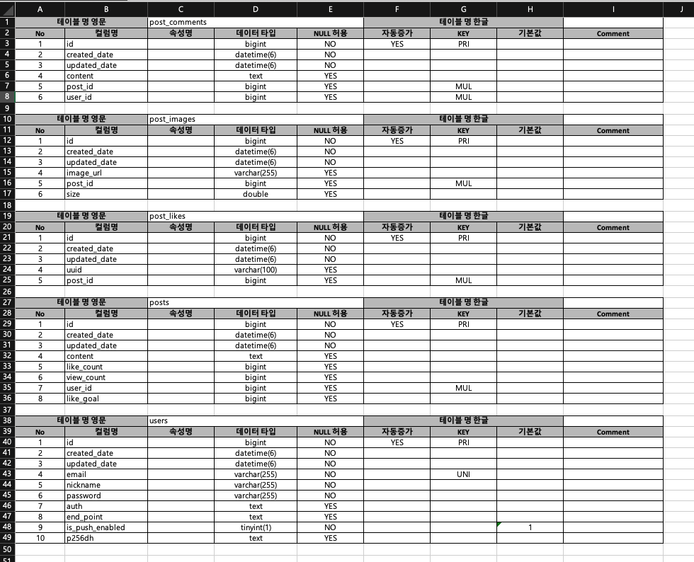

## Export Schema To Excel

### Example


### 실행 방법


### docker-compose.yml
```yaml
version: '3.8'

services:
  export-schema:
    image: zxz4641/export-schema-to-excel:1.0.3
    container_name: export-schema
    ports:
      - "8080:8080"
    environment:
      - DB_URL=${DB_URL}            ## DB 접속 정보 입력 ex) jdbc:mariadb://127.0.0.1:3306/database
      - DB_USERNAME=${DB_USERNAME}  ## DB 접속 계정 username
      - DB_PASSWORD=${DB_PASSWORD}  ## DB 접속 비밀번호 password
      - DB_DRIVER=${DB_DRIVER}      ## mariaDB > org.mariadb.jdbc.Driver, mysql > com.mysql.cj.jdbc.Driver
    restart: unless-stopped
```

docker-compose.yml 환경 변수 교체 후

`docker-compose up` 명령어 실행

브라우저에 http://localhost:8080/api/db-schema/excel 요청 후 DB_Schema.xlsx 파일 다운로드